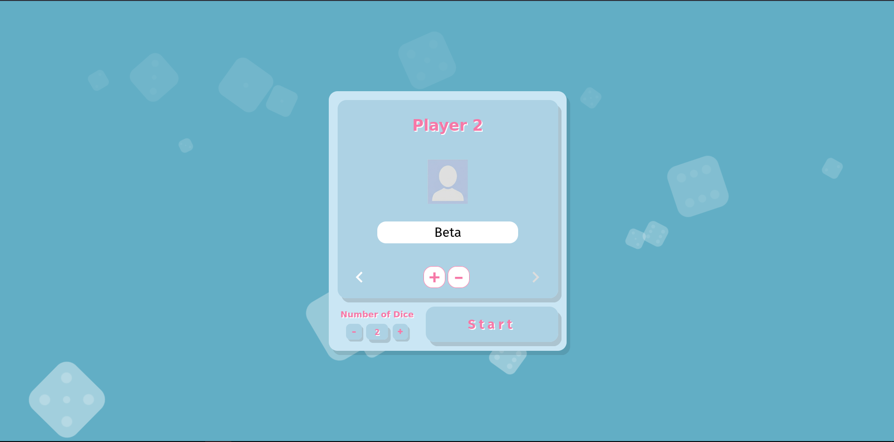
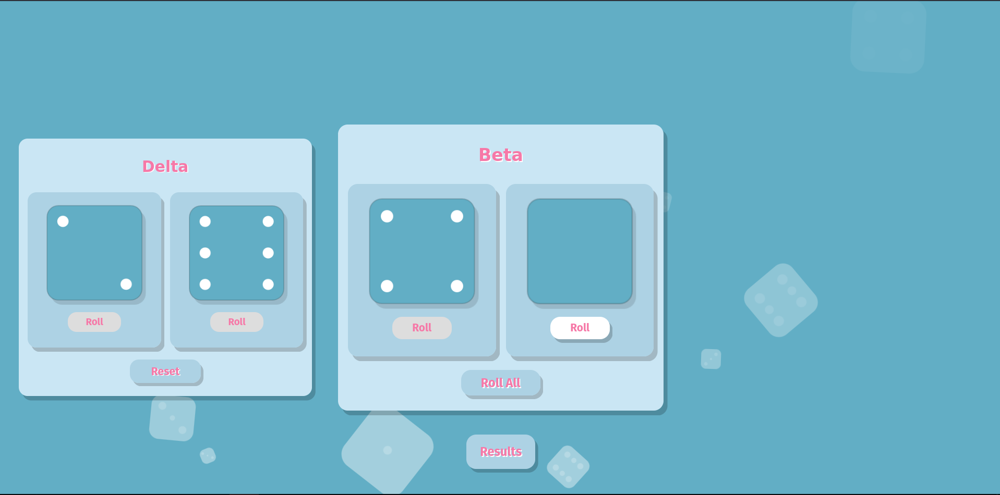
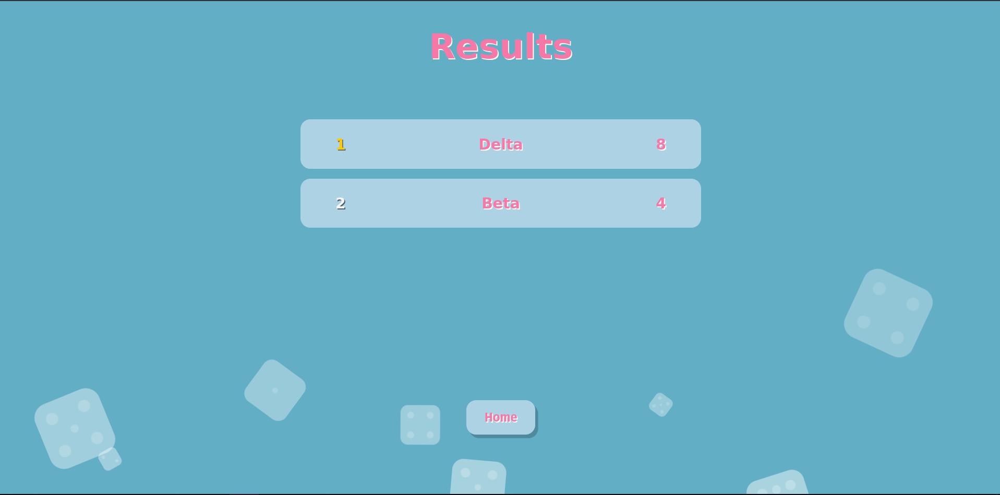

# Dice

A small browser-based dice game with a simple flow:

1. **Menu**: choose player names and number of dice
2. **Game**: roll dice for each player (per-die or “roll all”)
3. **Results**: leaderboard with tie grouping + smooth “one row per click” scrolling

This project is built with plain **HTML/CSS/JavaScript** plus **PHP sessions** to carry state between pages.

---

## Screenshots

> These images are included in the repository under `./img`.

### Menu



### Game



### Results



---

## Features

### Menu

- Add/remove players
- Navigate between players using left/right arrows
- Player avatars cycle through `img/1.png` … `img/5.png`
- Choose dice count (currently limited to **1–3** by the UI)

### Game

- Dice are drawn on HTML `<canvas>` (no images for dice faces)
- Roll a single die or roll all dice for a player
- After all dice for a player are rolled, the button changes to **Reset**
- Player “cards” are horizontally arranged; only the selected player can roll

### Results

- Leaderboard sorted by total (highest first)
- **Ties are grouped** (players with the same total share the same placement number)
- Scrollable results list:
  - Shows exactly **4 rows** at once
  - Scroll snapping
  - Up/down arrows scroll **exactly 1 row** per click
  - Scrollbar is hidden for a clean UI

---

## How to play

1. Open the **Menu** (`index.html`).
2. Add players and type their names.
3. Select how many dice each player will roll.
4. Click **Start**.
5. On the game screen:
   - Use **Roll** on individual dice, or **Roll All** to roll the entire row.
   - Once all dice for a player are rolled, **Roll All** turns into **Reset**.
6. Click **Results** to submit rolls.
7. On the results screen:
   - Use the arrows to scroll the leaderboard by one row at a time.
   - Click **Home** to go back to the menu.

---

## Tech stack

- **Frontend**: HTML + CSS + vanilla JavaScript
- **Backend**: PHP (sessions + form POST)
- **Hosting (local dev)**: works well with Apache + PHP (XAMPP/LAMPP)

---

## Running locally (XAMPP / LAMPP)

### 1) Put the folder under your web root

If you’re using LAMPP on Linux (common default):

- Place this project at:
  - `/opt/lampp/htdocs/Dice`

If you’re using XAMPP/MAMP/WAMP, place it inside the equivalent `htdocs` (or document root).

### 2) Start Apache (and PHP)

- Start your XAMPP/LAMPP control panel and ensure **Apache** is running.

### 3) Open the app

- In your browser:
  - `http://localhost/Dice/`

That loads `index.html`.

---

## Important behavior: PHP pages are POST-only

Both PHP pages are intentionally protected so they **cannot** be opened directly via URL:

- `php/game.php` redirects back to `index.html` unless the request is a POST
- `php/result.php` redirects back to `index.html` unless the request is a POST

This matches the intended flow:

`index.html (POST) -> php/game.php (POST) -> php/result.php`

---

## Project structure

```
Dice/
├─ index.html
├─ css/
│  ├─ style.css
│  ├─ menu.css
│  ├─ game.css
│  └─ result.css
├─ js/
│  ├─ menu.js
│  ├─ game.js
│  └─ result.js
├─ php/
│  ├─ game.php
│  └─ result.php
└─ img/
   ├─ menu.png
   ├─ game.png
   ├─ result.png
   ├─ 1.png … 5.png
   └─ ...
```

---

## Code walkthrough

### Menu page

- Entry point: `index.html`
- Styling: `css/menu.css` (+ shared `css/style.css`)
- Behavior: `js/menu.js`

**What it does**

- Adds/removes player input cards
- Manages focus and left/right navigation
- Updates the dice counter UI and disables buttons at min/max

**Form submission**

- The menu form sends a POST request to `php/game.php`:
  - `players[]` (player names)
  - `nDice` (dice count)

### Game page (PHP + JS)

- Page generator: `php/game.php`
- Styling: `css/game.css` (+ shared `css/style.css`)
- Behavior: `js/game.js`

**PHP responsibilities (`php/game.php`)**

- Reads menu POST data (`players[]`, `nDice`)
- Sanitizes player display names with `htmlspecialchars`
- Stores state in session:
  - `$_SESSION['players']`
  - `$_SESSION['nDice']`
- Generates one player “card” per player, and one dice-box per die
- Each die has a hidden input named:
  - `roll[playerIndex][dieIndex]`

**JS responsibilities (`js/game.js`)**

- Draws dice faces on `<canvas>`
- Tracks rolled state per die
- Animates the rolling (random faces during a short timer)
- Writes the final face (1–6) into the hidden input
- Ensures only the selected player can roll dice

**Default state**

- Unrolled dice:
  - hidden input is empty (`""`)
  - die face is displayed as `0` (blank)

### Results page (PHP + JS)

- Page generator + sorting: `php/result.php`
- Styling: `css/result.css` (+ shared `css/style.css`)
- Behavior: `js/result.js`

**Leaderboard logic**

- Each player’s total is computed by summing their submitted dice values.
- Players are sorted by:
  1. Total (descending)
  2. Original index (ascending) as a stable tie-breaker
- Ties are grouped into `orderedPlayers`, so placement numbers repeat for tied players.

Example grouping conceptually:

- `orderedPlayers[0]` → all players tied for 1st
- `orderedPlayers[1]` → all players tied for 2nd

**Scrolling UI**

- The results list is a scroll container with scroll snapping.
- Arrow clicks scroll by exactly one row height + row gap.
- Arrows hide/disable when you are at the top or bottom.

---

## Configuration notes

### Home button URL

The results page “Home” button currently navigates to:

- `http://localhost/Dice/index.html`

If your host, port, or folder name differs, update it in `js/result.js`.

---

## Development tips

- If PHP session data seems to disappear, verify your browser allows cookies for `localhost`.
- When changing UI sizing, the results list relies on CSS row height math to keep exactly 4 visible rows.
- Keep an eye on scroll snapping + row gap: the JS scroll step is computed as `rowHeight + rowGap`.

---

## License

This project is licensed under the MIT License.
See `LICENSE` for details.
